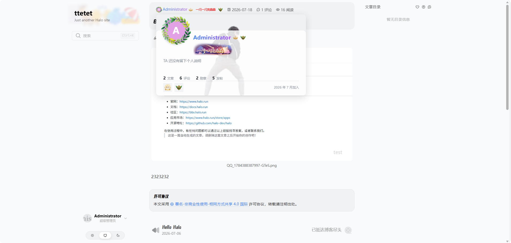
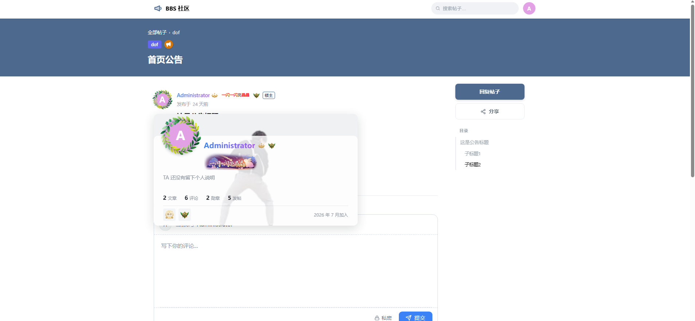

# 互动增强（Interaction Plus）

  

为 Halo 提供用户装饰、身份标识与前台展示能力的社区互动增强插件。

## 简介

互动增强用于丰富社区中的用户展示与激励，提供**装饰**与**身份展示**：站长管理勋章 / 头像框 / 称号 / 名片背景 / 昵称样式等装饰并授予用户，用户在个人中心佩戴，主题与其他插件可在前台展示这些装饰。

## 效果预览

> 前台展示由主题或提供前台页面的插件决定放在哪，Interaction Plus 不自动注入页面。以下为接入后的典型落点。

**评论区**：昵称行（头像框 + 昵称样式 + 身份标识 + 称号 + 勋章），点击展开用户卡


**个人页**：装扮展览（装饰墙）


**文章页**：作者行



**其他插件内**：论坛帖子里的作者身份（第三方插件在浏览器端写入 `hip-*` 标签即可）



## 功能特性

- **装饰资产管理**：5 类装饰（勋章、头像框、称号、名片背景、昵称样式），草稿 / 启用 / 停用 / 归档全生命周期，卡片 / 列表双视图，双场景（身份行 / 卡片）实时预览。
- **分类 / 标签 / 稀有度**：自定义元数据组织装饰；内置 5 档稀有度色阶。
- **授予与撤销**：单 / 多用户授予、按 Halo 角色快照批量授予、设有效期、撤销、保留历史。
- **个人中心装扮**：佩戴头像框 / 称号 / 主勋章 / 展示勋章（≤8）/ 名片背景 / 昵称样式，右侧实时预览；支持用户投稿。
- **身份标识**：把 Halo 角色映射成前台身份标牌（文字牌 / 图标 / 图片三选一 + 优先级）。
- **前台展示**：`hip-*` Web Component + 公开 HTTP API + Halo 模板 Finder，供主题或插件前台页在评论区 / 作者页 / 装饰墙展示（不自动注入页面）。
- **对外插件 API**：其他插件可在用户达成条件时发 / 撤装饰（发奖 API），或在后端查询用户公开身份与装扮、内嵌进自己的接口（身份查询 API）。
- **站内通知**：获得 / 撤销装饰、投稿通过 / 驳回、批量授予完成（发给操作者），走 Halo 原生通知。

## 安装

1. 在 Halo 应用市场搜索「互动增强」安装，或从 [GitHub Releases](https://github.com/Tim0x0/halo-plugin-interaction-plus/releases) 下载 `1.0.0` jar，在「插件 → 安装」上传。
2. 安装后启用插件，左侧菜单出现「互动」分组。

## 使用

站长从安装、创建装饰、授予、设置到用户中心的完整说明见[站长使用指南](docs/site-admin.md)。摘要：

### 管理端（Console）：「互动 → 装饰」

- **资产**：创建 / 编辑装饰，选素材、配类型扩展（称号名称、昵称渐变色等），启用后方可授予。
- **授予**：选装饰 + 搜索多选用户（或按 Halo 角色快照），设有效期 / 原因，批量授予；可撤销并查看授予历史。
- **元数据**：维护分类 / 标签 / 稀有度（拖拽排序，删除按引用保护）。
- **身份标识**：把角色映射成前台标牌（按优先级展示）。
- **自定义组件**：贴 HTML / CSS 完全接管 `hip-*` 组件渲染（仅超级管理员）。

### 用户中心（UC）：「互动 → 装扮」

- **我的装扮**：在库存里佩戴 / 取下各类装饰，右侧实时预览效果，保存后生效。
- **我的投稿**：提交自制装饰草稿（需站长开放投稿，并经审核启用）。
- **公开装扮墙**：开关在「用户中心 → 个人资料 → 装扮」，关闭后装饰墙接口返回空数组。

## 前台展示（主题 / 插件对接）

Runtime 经 ReverseProxy 暴露，主题或独立插件前台的 Thymeleaf 模板按需引入**一个 JS**（插件**不自动注入页面**，也没有配套 CSS —— 组件样式全在各自 Shadow DOM 模板里）：

```html
<th:block th:if="${pluginFinder.available('interaction-plus')}">
  <script th:src="${interactionPlus.getRuntimeUrl()}"></script>
</th:block>
```

Finder 会输出带当前插件版本的 Runtime 地址，使固定文件名对应当前版本的浏览器缓存；接入方无需手工填写版本号。

- **Web Component**：写 `hip-*` 标签即可（含用户卡点击浮层）。
- **身份数据 Finder / 公开 HTTP**：只取数据、完全自绘 HTML 时用。
- **长得不像你的主题**：三个组件都可以整份接管渲染 —— 主题内嵌 `<template data-hip="...">`，或站长在后台贴 HTML/CSS。

组件用法、Finder、公开 API、自定义模板见[前台适配指南](docs/theme-integration.md)。

第三方插件接入的完整示例见演示插件 [BBS 社区](https://github.com/Tim0x0/halo-plugin-bbs)（置顶公告与社区帖子的 BBS 插件）。

## 对外 API（其他插件对接）

均经 Halo `ExtensionGetter` 取用、以可选依赖声明，`interaction-plus` 缺席时自动降级：

- **发奖（写）**：在用户达成你定义的条件（签到、积分……）时发放 / 撤销装饰（`DecorationGrantApi`：`listGrantable` / `grant` / `revoke`）。条件判断在调用方，本插件只负责发与撤。
- **身份查询（读）**：在你的插件后端（进程内）查询用户公开身份与装扮，内嵌进你自己的接口响应（`PublicIdentityQueryApi`：单查 / 批量，与公开 HTTP API 同源）。
- **统计贡献（反向扩展点）**：实现 `UserStatContributor`，把你插件领域内的用户统计项（采纳数、获赏数……）贡献到用户卡数据行与公开身份数据中。

## 文档

| 文档 | 受众 |
|---|---|
| [站长使用指南](docs/site-admin.md) | 站长：安装、创建装饰、授予、身份标识、设置、权限、用户中心 |
| [前台适配指南](docs/theme-integration.md) | 主题作者与提供前台 Thymeleaf 页面的插件作者：`hip-*` 组件、Finder、公开 HTTP API、自定义模板 |
| [对外插件 API 对接指南](docs/plugin-api-integration.md) | 插件开发者：发奖 API（写）+ 身份查询 API（读）+ 统计贡献扩展点（反向） |

## 配置

`插件 → 互动增强 → 设置`，分「基础设置」「装饰展示」「装饰管理」三组：类型总闸与公开身份缓存；身份行 / 头像 / 用户卡展示；用户投稿开关、失效授予记录保留清理。逐项说明见[站长使用指南 · 插件设置](docs/site-admin.md#插件设置)。

## 默认数据

首次启动自动创建 5 个默认稀有度：**普通、稀有、史诗、传说、限定**（灰 / 蓝 / 紫 / 金 / 红色系）。非游戏化社区可在「互动 → 装饰 → 元数据 → 稀有度」自行修改或删除，删除后不会自动重建。

## 未来计划

装饰只是互动增强的第一块，后续将围绕站点互动补齐「签到 / 数值 / 等级」闭环。以下方向已立项、尚未排期，细节可能调整：

- **签到与经验等级**：每日签到累积经验，经验查表升级，达级自动发放装饰（里程碑奖励）。
- **积分体系**：独立于经验的货币数值，远期支持用积分兑换限定装饰。
- **对外开放深化**：其他互动类插件可将自身领域的互动信号喂入全站经验 / 积分；等级可投影为 Halo 角色，让任意插件按角色控权、无需单独对接。

当前版本的功能与接口完整可用，不受上述计划影响。

## 开发

```bash
# 启动 Halo 开发环境（需 Docker）
./gradlew haloServer
# Console / UC 前端开发
cd ui && pnpm install && pnpm dev
# 前台 runtime 组件开发
cd runtime && pnpm install && pnpm dev
```

开发环境：Halo `>= 2.25.0`、Java 21+、Node.js 22+、pnpm 10。

## 构建

```bash
./gradlew build
```

产物 jar 在 `build/libs` 目录。

## 许可证

[GPL-3.0](./LICENSE) © Tim0x0
