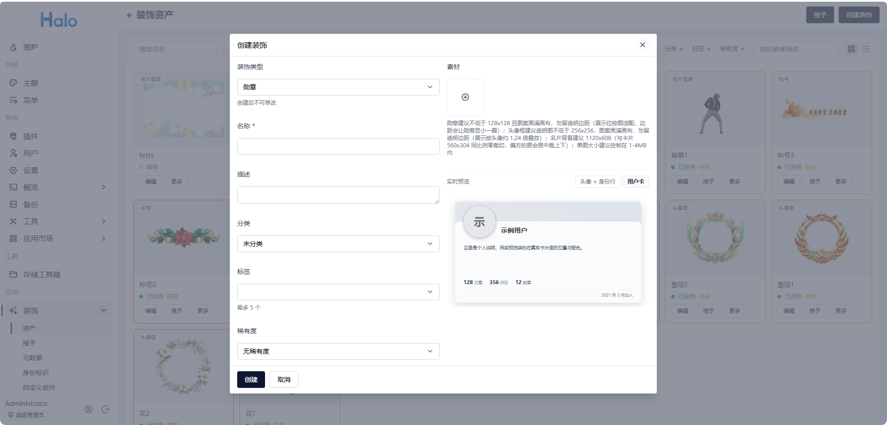
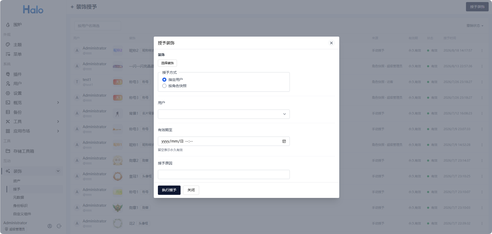
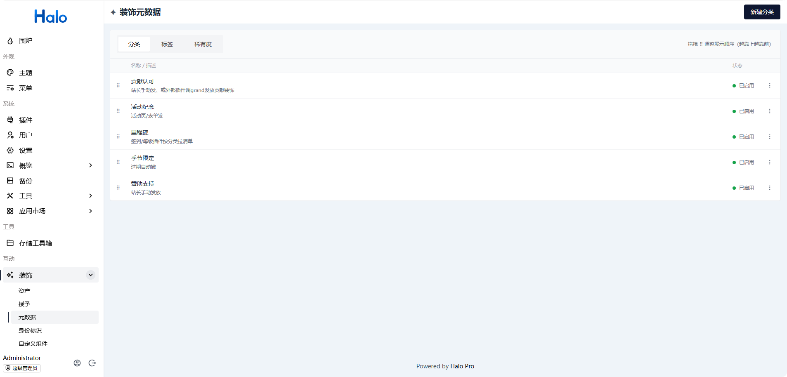
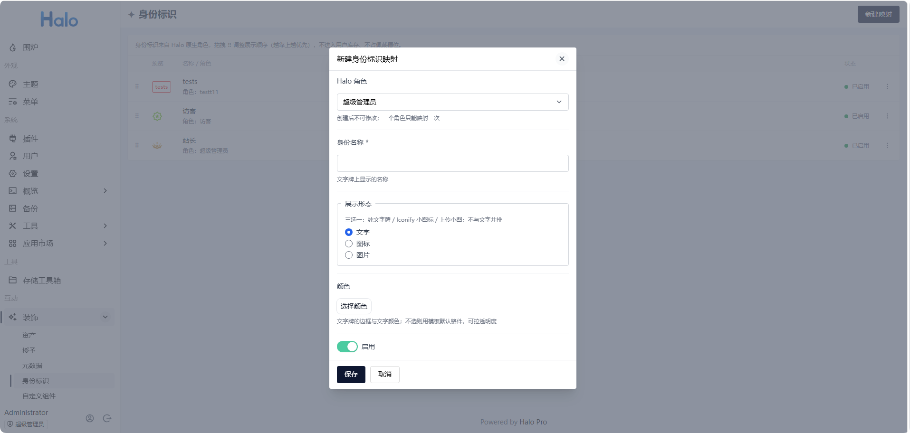
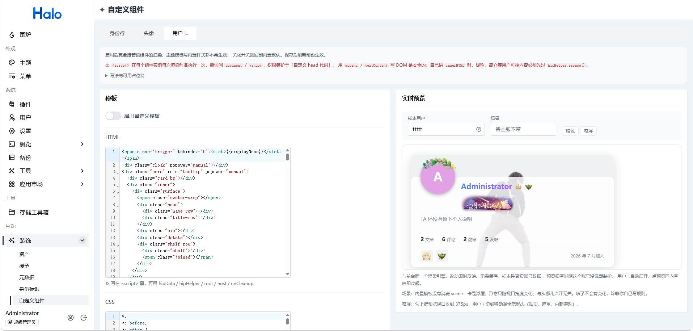
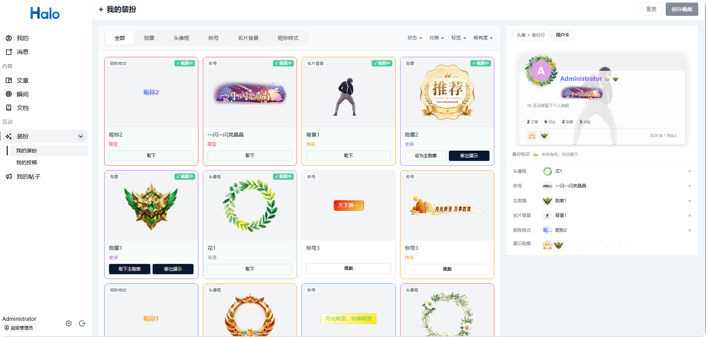
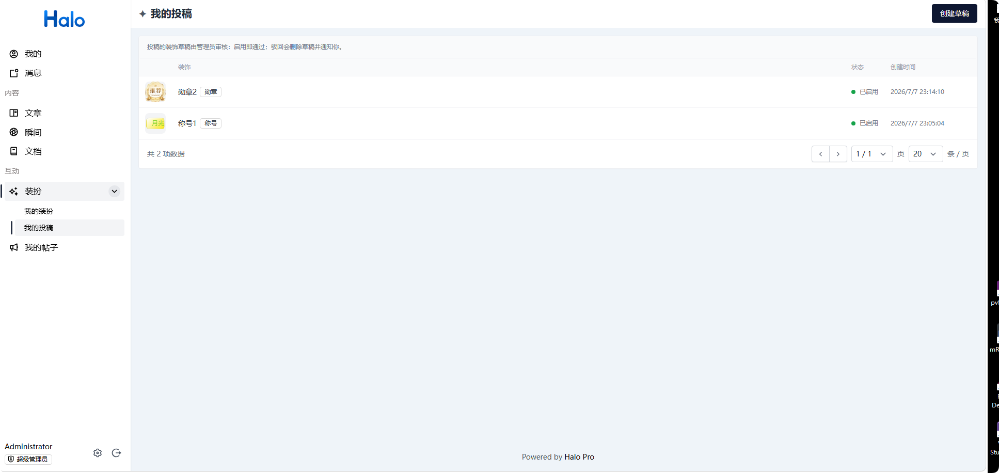
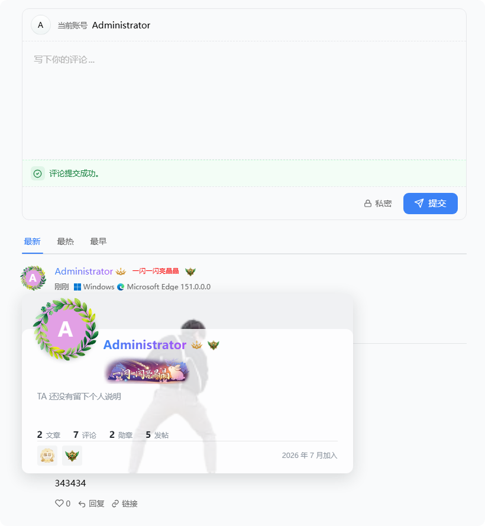

# 互动增强 · 站长使用指南

面向 **Halo 站长**：安装插件之后如何创建装饰、授予用户、配置前台展示。

> 主题作者与提供前台 Thymeleaf 页面的插件作者请看[前台适配指南](theme-integration.md)；其他插件开发者请看[对外插件 API 对接指南](plugin-api-integration.md)。

## 能做什么

插件给站点加上一套**用户装扮**与**身份展示**：

| 能力 | 说明 |
|---|---|
| 5 类装饰 | 勋章、头像框、称号、名片背景、昵称样式 |
| 授予 | 发给指定用户，或按 Halo 角色一次性快照发给当前成员 |
| 身份标识 | 把 Halo 角色映射成前台标牌（管理员、版主……），不进库存、不占佩戴槽 |
| 前台展示 | 主题或前台插件接入后，评论区 / 作者行 / 点击浮卡能看到装扮 |
| 用户中心 | 用户自己佩戴、投稿草稿、决定是否公开装扮墙 |

**插件不会自动往主题页面塞任何东西。** 装上之后后台就能管装饰，但评论区要出现头像框 / 身份行，需要主题（或评论插件）写入 `hip-*` 标签。详见[前台怎么出现](#前台怎么出现)。

## 安装与入口

1. 在 Halo 应用市场搜索「互动增强」，或从 [GitHub Releases](https://github.com/Tim0x0/halo-plugin-interaction-plus/releases) 下载 `1.0.0` jar，在「插件 → 安装」上传。
2. 启用插件。左侧出现「**互动**」分组。
3. 首次启动会自动创建 5 个默认稀有度：**普通 / 稀有 / 史诗 / 传说 / 限定**（灰 / 蓝 / 紫 / 金 / 红）。删掉后重启**不会**重建。

需要 Halo `>= 2.25`。

| 位置 | 路径 |
|---|---|
| 管理端 | 左侧「互动 → 装饰」：资产 / 授予 / 元数据 / 身份标识 / 自定义组件 |
| 插件设置 | 「插件 → 互动增强 → 设置」：基础设置、装饰展示、装饰管理 |
| 用户中心 | 「互动 → 装扮」：我的装扮、我的投稿；公开装扮墙开关在「个人资料 → 装扮」 |

子菜单按权限显示：没有某项权限的人看不到对应页。自定义组件**只有超级管理员**能进。

## 核心概念

先分清三件事，后面所有操作都围着它们转。

**装饰 ≠ 佩戴。** 站长（或其他插件）把装饰**授予**用户，装饰进入该用户的库存；用户要自己到「我的装扮」里**佩戴**，前台才会显示。授予成功不等于头像上立刻出现头像框。

**身份标识 ≠ 装饰。** 身份标识按 Halo 角色映射，系统赋予、无需授予、不进库存。改映射会立刻清空公开身份缓存；用户角色变动要等缓存过期（默认 30 秒），或把 TTL 调到 0。

**持有可以来自多方。** 后台手动授予、角色快照、外部插件发放，各自独立记账。用户**持有 = 任一来源还有一条有效授予**。只撤其中一条，用户可能仍持有。

五种装饰：

| 类型 | 素材 | 前台落点 |
|---|---|---|
| 勋章 | 图（必填） | 身份行主勋章；用户卡主勋章 + 展柜 |
| 头像框 | 透明图（必填） | 头像组件叠在头像外；用户卡头像 |
| 称号 | 名称必填，图可选 | 身份行只用文字牌；用户卡有垂直空间才显示图 |
| 名片背景 | 图（必填） | 仅用户卡 |
| 昵称样式 | 无素材，配纯色 / 渐变 | 身份行与用户卡的昵称着色 |

## 最快看到效果

主题已经接入 `hip-*` 的前提下，最短路径：

1. **互动 → 装饰 → 资产 → 创建装饰**，类型选「勋章」或「头像框」，上传素材，保存。
2. 列表里对该装饰点 **启用**（新建默认是草稿，未启用不能授予）。
3. 点 **授予**，选几个用户，有效期留空（永久），执行授予。
4. 用被授予的账号登录用户中心 → **装扮 → 我的装扮**，点选刚拿到的装饰，**保存**。
5. 打开前台评论区或作者行，应能看到装扮。

若第 5 步什么都没有：先确认主题有没有写 `hip-*` 标签（见[前台怎么出现](#前台怎么出现)）；再确认「插件 → 设置 → 基础设置」里对应类型总闸是开的。

## 装饰资产

路径：**互动 → 装饰 → 资产**。



一张图里有三样东西：左侧「互动 → 装饰」的五个子菜单、背景的资产卡片网格、创建装饰弹窗（左表单 / 右实时预览）。

### 列表

- 默认卡片网格，可切列表。筛选：名称、类型、状态、分类、标签、稀有度、投稿者。
- 卡片点缩略图打开预览；行内 / 卡片两档都能看（头像框在「头像 + 身份行」档才能看见叠放效果）。

### 创建 / 编辑

弹窗左侧通用字段，右侧随类型变化 + 实时预览。

| 字段 | 说明 |
|---|---|
| 装饰类型 | 创建后不可改 |
| 名称 | 必填，后台列表与用户库存里显示的名字 |
| 装饰标识 | 仅编辑时出现，形如 `asset-01hxyz…`。其他插件发奖时用这个值，可一键复制 |
| 描述 | 可选 |
| 分类 | 最多 1 个，可空 |
| 标签 | 最多 5 个 |
| 稀有度 | 最多 1 个，可空。稀有度色会描在卡片边框上 |

类型专属：

| 类型 | 要填什么 |
|---|---|
| 勋章 / 头像框 / 名片背景 | 一张图 |
| 称号 | **称号名称**（行内展示的文字，必填）；文字色 / 背景色可选（不选则继承正文 / 无底，可拉透明度）；第二背景色仅在有主背景时出现，两者形成渐变；**称号图片可选** |
| 昵称样式 | 纯色 1 个颜色，或渐变 2–3 个颜色。无素材位 |

预览默认停在用户卡（唯一能看全所有类型的落点），可切到「头像 + 身份行」。预览用干净示例用户，不套你自己身上的其他装扮，避免干扰判断。

### 素材建议

| 类型 | 建议 |
|---|---|
| 勋章 | ≥ 128×128，图案画满画布、不要留一圈透明边距（展示位按图适配，边距会让勋章显小） |
| 头像框 | 透明底 PNG / WebP / SVG / GIF，≥ 256×256，图案画满画布。展示按头像约 1.24 倍叠放 |
| 称号图 | 可选。细长横条（宽高比约 2:1 ~ 10:1），内容画满、勿留透明边距。卡片按最高 48px 缩放；图内文字约占画布高 1/3 时大约 16px、够读。**评论等行内场景不显示这张图**，只用称号名称 |
| 名片背景 | 1120×596（与卡片 560×298 同比例，零裁切）；偏方的图会居中裁上下。接受 PNG / WebP / JPEG / GIF，**不接受 SVG** |
| 体积 | 单图建议 1–4 MB |

颜色一律支持 `#RGB` / `#RRGGBB` / `#RRGGBBAA`（8 位带透明度）。

### 状态

```
草稿 ──启用──► 已启用 ──停用──► 已停用
                   │               │
                   └──归档─────────┴──► 已归档 ──取消归档──► 已停用
```

| 状态 | 能否授予 | 已持有的人 |
|---|---|---|
| 草稿 | 否 | — |
| 已启用 | 是 | 可佩戴、前台展示 |
| 已停用 | 否 | 库存里变「已下架」，已佩戴的会失效（用户可自行取下） |
| 已归档 | 否 | 同下架 |

只有**已启用**才能授予。资产页对已启用项直接提供「授予」按钮。

启用前会校验：勋章 / 头像框 / 名片背景必须已选素材；称号必须有称号名称（图可选）；昵称样式必须配好颜色。SVG 还会做安全检查（含脚本、事件属性或外链会被拒绝）。草稿阶段可以先保存再补。

**删除**任何状态都可以。若仍有人持有，确认框会告诉你影响人数：删除会撤销这些有效授予并清掉佩戴槽，授予历史保留（列表里显示「（已删除的装饰）」）。级联撤销**不**逐个给用户发「装饰被撤销」通知。

### 审核用户投稿

没有独立的「待审」菜单。用户投稿进来也是一条**草稿**资产：

1. 资产列表用「按投稿者筛选」，或筛状态「草稿」。
2. **启用 = 通过**，投稿者收到「你的装饰投稿已通过」。启用后还要再授予，用户才能戴——通过不等于自动发到投稿者库存。
3. **删除该草稿 = 驳回**，投稿者收到「你的装饰投稿未通过」。用户自己删草稿不发这条通知。

投稿入口本身还受「装饰管理 → 启用用户投稿入口」和「提交装饰草稿」权限同时控制，见[装饰管理](#装饰管理)。

## 授予与撤销

路径：**互动 → 装饰 → 授予**。资产页对已启用装饰也能直接点授予。



背景是授予记录列表（用户 / 装饰 / 来源 / 有效期 / 状态 / 授予时间），前景是授予弹窗。

### 发起授予

弹窗里：

1. **选择装饰**（可多选；选择器只列出已启用的）。
2. **授予方式**
   - **指定用户**：搜索多选。
   - **按角色快照**：选一个或多个 Halo 角色，发给**此刻**拥有该角色的用户。这是一次性快照，之后角色变动**不会**自动补发或收回。
3. **有效期至**：留空 = 永久。必须晚于当前时间。
4. **授予原因**：可选，会出现在授予记录里。

指定用户路径单次「用户 × 装饰」最多 **200** 对，超出请分批。角色快照按站点角色规模展开，不设这个上限。

结果：全部顺利则 Toast 后关闭；有跳过 / 失败会留在弹窗里给明细。

| 结果 | 含义 |
|---|---|
| 成功 | 新发放 |
| 续期 | 该用户已持有你（后台）发的同一装饰，本次有效期更晚，已延长 |
| 跳过 | 已持有相同或更长有效期，幂等未改 |
| 失败 | 用户不存在、装饰未启用 / 已删除等 |

同源重复授予**只延长不缩短**。要提前收回走撤销。

批量授予完成后，操作者本人会收到一条「装饰批量授予完成」（成功 / 跳过 / 失败计数）。用户侧：新获得会合并成一条「你获得了新的装饰」；已经因其他来源持有、这次只是补一条来源的，不再重复打扰。

### 记录、撤销、再次授予

列表可按用户名、撤销状态筛选。来源列区分：

- 手动授予
- 角色快照 ·（角色显示名）
- 插件 ·（来源插件 id）

悬停来源列可看授予原因。

- **有效** → 撤销。可填撤销原因（会写进发给用户的通知）。
- **已过期 / 已撤销** → 再次授予（预填原用户与原装饰）。

若该用户此装饰还有其他来源的有效授予，撤销弹窗会明示，并提供「一并撤销全部来源」——不勾则只撤本条，用户仍持有。

撤销成功且用户不再持有时，对应佩戴槽会被清掉，用户收到「你的装饰已被撤销」。

## 分类 / 标签 / 稀有度

路径：**互动 → 装饰 → 元数据**。页内三个 Tab，配置类数据全量加载、拖拽排序（越靠上越靠前），改完点「保存排序」。



图为「分类」Tab；标签与稀有度是同样的列表 + 拖拽结构。

| | 分类 | 标签 | 稀有度 |
|---|---|---|---|
| 用途 | 分组筛选 | 多维标记 | 品质色阶；控制外部插件能不能发 |
| 颜色 | 无 | 有（可选） | 有（可选），描在资产卡片边框上 |
| 每件装饰 | 最多 1 | 最多 5 | 最多 1 |

公共字段：显示名称、描述、启用。停用不影响已引用的装饰，只是新选的时候仍能看到（筛选项标「已停用」）。

**稀有度额外有「允许外部发放」**：关掉后，其他插件的发奖 API 发不出该稀有度下的装饰（清单里没有，调用也返回拒绝）。用来保护传说 / 限定。后台手动授予不受此开关影响。

删除前会查引用数。有装饰在用时，删除会从那些装饰上摘掉该分类 / 标签 / 稀有度。

默认五档可改名、改色、删除。非游戏化社区可以整组换成自己的叫法，或全删掉不用。

## 身份标识

路径：**互动 → 装饰 → 身份标识**。需要「管理互动配置」权限。

把 Halo 角色映射成前台标牌。不进用户库存、不占佩戴槽，拥有该角色的用户自动带上。一个角色只能映射一次，创建后角色不可改。



背景列表里能看到三种形态并存（文字牌 / 图标 / 图片），前景弹窗是形态三选一。

- 拖拽调整优先级（越靠上越优先）。前台按此顺序截取，截几条由[装饰展示](#装饰展示)的「身份标识数量」决定。
- 展示形态三选一，不与文字并排：

| 形态 | 前台 |
|---|---|
| 文字 | 带色边框的文字牌；颜色不选则用模板默认铬件 |
| 图标 | 从 Iconify 选一个字形；颜色在选择器里写入 SVG，前台原样渲染 |
| 图片 | 上传小图；加载失败回落为文字牌 |

「身份名称」在文字形态是牌面；在图标 / 图片形态是悬停提示，裂图时也用它回落。

停用或删除映射后，对应角色的用户不再展示该标识（映射一改，缓存立刻清空）。用户在 Halo 里被换角色后，要等公开身份缓存过期才会变。

## 插件设置

路径：**插件 → 互动增强 → 设置**。三组。

### 基础设置

站点级、与具体组件无关的两项。保存后立刻清空服务端缓存。

**类型开关**是总闸。关掉某类后，所有场景都不展示，用户佩戴状态保留——再打开立刻恢复。身份标识总闸关掉则前台不再出标牌。总闸关了，「装饰展示」里的场景开关再开也没用。

| 项 | 默认 | 说明 |
|---|---|---|
| 公开身份缓存（秒） | 30 | 0–300，0 = 每次实时查。佩戴、授予、撤销会主动失效该用户缓存；改任何插件设置都会使整份缓存失效 |

### 装饰展示

保存后立刻清空服务端缓存；已打开的前台页面刷新即可看到。

三个分组对应三个前台组件，互不影响：

| 分组 | 作用对象 | 可调 |
|---|---|---|
| 身份行 | `hip-user-identity`（评论 / 作者昵称行） | 称号、主勋章、昵称样式、身份标识；标识数量 1–3（默认 1） |
| 头像 | `hip-user-avatar` | 是否叠头像框 |
| 用户卡 | `hip-user-card` | 称号、主勋章、展柜、昵称样式、身份标识、头像框、名片背景；展柜数量 0–8（默认 5，超出收进「+N」）；标识数量 1–5（默认 3） |

另外两项：

| 项 | 默认 | 说明 |
|---|---|---|
| 无头像占位 | Halo 风格 | 用户没设头像或头像加载失败时，内置组件画的占位。Halo = 灰底首字母；Hash = 按显示名着色（Flarum 算法）。不改公开数据里的 `avatar` 字段；自定义模板若自己画占位，不受此项影响 |
| 用户卡跳转链接 | `/authors/{name}` | 身份行昵称、用户卡头像 / 名字的跳转模板。`{name}` 换成用户名。**清空则两处一起关闭**。主题没有作者页时请改成实际个人页，或留空 |

### 装饰管理

| 项 | 默认 | 说明 |
|---|---|---|
| 启用用户投稿入口 | 开 | 关了用户中心不出现投稿入口。开了还要给角色「提交装饰草稿」权限，两边同时满足才看得到 |
| 失效授予记录保留天数 | 30 | 已撤销 / 已过期的记录超过该天数后，每天凌晨 3 点自动删。**有效授予永不删**。0–3650，0 = 永不清理 |

## 自定义组件

路径：**互动 → 装饰 → 自定义组件**。

**只有超级管理员能进**（没有可分配的角色模板）。模板 HTML 可以含 `<script>`，在每个组件实例每次渲染时执行，能访问 `document` / `window`——写权限等于「自定义 head 代码」。

三个独立槽位：身份行 / 头像 / 用户卡。每个都有「启用自定义模板」开关，关掉即回内置默认。



左侧 HTML / CSS 两个框，右侧实时预览。图中开关是关闭状态（走内置默认），但编辑框里已预填内置模板全文。

打开编辑器时，空内容会预填内置默认模板全文，所以「改个颜色」是改一行，不是从零写。

| 操作 | 说明 |
|---|---|
| 保存 | 当前 Tab。提示「刷新前台生效」 |
| 恢复内置默认 | 只用当前内置模板覆盖当前 Tab 的编辑内容，**尚未写入**，还需再保存。此操作会丢掉当前 Tab 的改动，请先自行备份。三个 Tab 相互独立，需要恢复哪个就在哪个 Tab 执行「恢复 + 保存」 |

实时预览与前台同一套引擎，改动即时反映、不用先保存。样本用户默认是你自己（真实装扮数据）；预览很空说明这个账号没佩戴。可切暗色 / 窄屏，可填 `scene` 看分档。用户卡会自动展开，点预览区内空白即收。

模板优先级：后台这份 > 主题内嵌 `<template data-hip="...">` > 插件内置。契约（占位符、`hipData`、`hipHelper`、场景分档、明暗）见[前台适配指南 · 自定义模板](theme-integration.md#自定义模板)，后台页说明区也有一份摘要。

> ⚠ **改用户卡模板前先看这个**：它的插槽、`popover` 定位、多卡互斥、外点关闭四段逻辑删掉或改写都会出具体故障（全站空白 / 卡被主题盖住 / 卡越点越多 / 卡关不掉）。逐条说明见[前台适配指南 · 重写用户卡模板时的注意事项](theme-integration.md#重写用户卡模板时的注意事项)。身份行与头像没有这些约束。

想参考完整案例：[用户卡案例模板](samples/)（票根 + 通行证风格，整卡替换，附安装说明）。

## 用户中心

登录用户默认都有「佩戴我的装饰」权限（聚合到全体已登录用户，角色列表里隐藏）。

### 我的装扮

路径：用户中心 → **互动 → 装扮 → 我的装扮**。



左侧库存，右侧预览 + 槽位摘要。

- 类型 Tab + 筛选（状态 / 分类 / 标签 / 稀有度）。历史项（过期 / 撤销 / 下架）默认隐藏，筛「全部状态」才出现。
- 同一装饰的多次授予合并成一张卡：任一来源仍有效且资产已启用即为「可用」；撤销或过期后重发同一装饰，会自动恢复为「可用」。没有有效授予时，按最近发生的撤销 / 过期事件归类。
- 点选即切换佩戴，右侧即时预览，**点保存才生效**。离开页面有未保存改动会确认。
- 槽位：头像框、称号、名片背景、昵称样式各 1 件；勋章分**主勋章 1** + **展柜最多 8**。主勋章和展柜可以是同一枚，也可以不同。
- 失效的佩戴（过期、被撤、装饰被停用）**不会自动卸掉**，槽位上有角标，是否取下由用户决定。
- 身份标识只读，来自角色映射，这里改不了。
- 有效期：永久的不显示；7 天内到期会标黄倒计时。

### 我的投稿

需要「提交装饰草稿」权限，且站长打开了投稿入口。



- 创建草稿，表单与后台创建装饰相同（类型、素材、称号 / 昵称配置），元数据选项来自站长已启用的分类 / 标签 / 稀有度。
- 仅**待处理（草稿）**能再编辑或自行删除。管理员启用 / 删除之后，列表里还能看到结果状态，但不能再改。
- 通过或驳回走站内通知。

### 公开装扮墙

路径：用户中心 → **个人资料 → 装扮**（不是「互动 → 装扮」）。

开关默认开。关掉后，主题的装饰墙接口返回空数组；**不影响**评论区等位置已经佩戴的装扮。用户卡数据行里的勋章计数也会隐藏（公开身份里 `stats.decorations` 为 `null`）。

## 权限

Halo「用户 → 角色」里，模块名「互动增强」。按需勾选，不必全给一个人。

| 角色模板 | 能做什么 | 默认给谁 |
|---|---|---|
| 管理装饰资产 | 资产 CRUD、启用 / 停用 / 归档、元数据 | 需显式分配 |
| 授予与撤销装饰 | 授予、撤销、看授予记录；读资产以便选择 | 需显式分配 |
| 管理互动配置 | 身份标识映射 | 需显式分配 |
| 提交装饰草稿 | 用户中心「我的投稿」 | 需显式分配（还要开投稿入口） |
| 佩戴我的装饰 | 用户中心「我的装扮」 | 全体登录用户（隐藏项） |
| （无模板）自定义组件 | 自定义组件页 | **仅超级管理员**，无法分配给编辑 / 作者 |

「装饰」父菜单：拥有上面任意一项 Console 权限即可见，点进去跳到该人有权的第一个子页。

典型分法：

- 内容编辑：只给「授予与撤销」，让他们发勋章但不能改素材。
- 美工 / 运营：给「管理装饰资产」+「授予」。
- 身份标识涉及角色展示，建议只给站长或管理员。

## 通知

走 Halo 原生通知中心，用户可在个人中心通知偏好里关闭某一类。

| 收到的标题 | 通知偏好里的名字 | 发给谁 | 何时 |
|---|---|---|---|
| 你获得了新的装饰 | 获得装饰 | 用户 | 新获得（同批次多件合并一条）。已经因其他来源持有的，补发来源不再通知 |
| 你的装饰已被撤销 | 装饰被撤销 | 用户 | 撤销后不再持有。可带撤销原因。删除装饰引发的级联撤销不发这条 |
| 你的装饰投稿已通过 | 装饰投稿已通过 | 投稿者 | 管理员启用了带 `submittedBy` 的草稿 |
| 你的装饰投稿未通过 | 装饰投稿未通过 | 投稿者 | 管理员删除了该草稿（用户自己删不发） |
| 装饰批量授予完成 | 装饰批量授予完成 | 操作者 | 一次批量授予跑完，含成功 / 跳过 / 失败计数 |

两列名字不同是正常的：左边是用户收到的那条消息的标题，右边是通知偏好列表里的分类名，要关某一类得按右边找。

## 前台怎么出现

插件**不自动注入页面**，也没有要单独引入的 CSS。主题或独立插件前台模板需要：

1. 引入一个 JS：

```html
<th:block th:if="${pluginFinder.available('interaction-plus')}">
  <script th:src="${interactionPlus.getRuntimeUrl()}"></script>
</th:block>
```

`getRuntimeUrl()` 会自动带上当前安装的插件版本，使固定文件名对应当前版本的浏览器缓存；站长和接入方不需要手写 `?v=`。

2. 在评论作者、文章作者等位置写入组件：

```html
<hip-user-card th:user-name="${comment.spec.owner.name}">
  <span th:text="${comment.spec.owner.displayName}">用户名</span>
</hip-user-card>

<hip-user-avatar user-name="alice" scene="comment"></hip-user-avatar>
<hip-user-identity user-name="alice" scene="comment"></hip-user-identity>
```



接好之后的样子：昵称行上是头像框、昵称样式、身份标识、称号与勋章，点昵称展开用户卡。

三个组件：

| 标签 | 作用 |
|---|---|
| `hip-user-avatar` | 头像 + 头像框 |
| `hip-user-identity` | 昵称行：昵称样式 + 身份标识 + 称号 + 主勋章 |
| `hip-user-card` | 点击展开的用户卡（桌面宽 560；窄屏 ≤640px 全宽 + 遮罩） |

用户卡走浏览器 top layer，一般不必为它改主题的 `z-index` / `overflow`。

**官方评论插件若由浏览器端渲染评论 DOM**，主题的 Thymeleaf 画不到那段——需要该评论组件自己支持嵌入 `hip-*`。这不是本插件能单独解决的。

完整约定、Finder SSR、公开 HTTP、自定义模板契约：[前台适配指南](theme-integration.md)。

## 与其他插件配合

其他 Halo 插件可以：

- **发 / 撤装饰**（签到满 7 天发勋章等）。装饰仍由你在本插件后台创建；对方插件只决定何时发。可在稀有度上关「允许外部发放」拦住传说 / 限定。
- **在自己的接口里附带用户装扮**（例如评论列表带作者身份）。
- **往用户卡数据行贡献统计**（采纳数、获赏数等）。

对接说明给插件作者：[对外插件 API 对接指南](plugin-api-integration.md)。站长侧需要知道的：

- 发奖用的「装饰标识」在资产编辑弹窗顶部，一键复制。
- 外部发来的授予出现在授予列表，来源列为「插件 · xxx」。可以按条撤销，也可以「一并撤销全部来源」彻底收回。
- 对方插件若在 Halo「设置 → 扩展点」里被指定过实现，之后本插件卸载再重装，可能会**静默失联**——到扩展点设置里重新选一次（或清掉该项）。

## 常见问题

**装上了，评论区完全没变化。**  
插件不注入页面。请接入方按[前台适配指南](theme-integration.md)引入 runtime 并写入 `hip-*`。若评论由前端组件渲染，还需要那个组件支持嵌入标签。

**授予成功但前台没有头像框 / 勋章。**  
授予只进库存。用户必须到「我的装扮」佩戴并保存。身份标识除外（按角色自动出现）。

**用户卡点开被旁边的头像挡住，或被评论容器裁掉。**  
内置模板靠卡与遮罩上的 `popover` 把浮层送进浏览器 top layer，不受主题的层叠上下文与 `overflow: hidden` 影响。若你写了自定义用户卡模板又去掉了这些 `popover` 属性与 `showPopover()` / `hidePopover()` 调用，卡就退回普通层级，会被主题盖住或裁切。未启用自定义模板则无需处理。

**改了展示设置 / 身份标识，前台过一会儿才变。**  
改展示设置、改身份标识映射会立刻清空服务端缓存；佩戴 / 授予 / 撤销会立刻失效该用户。已经打开的页面不会自动重拉，刷新一下即可。用户在 Halo 里被换角色后，才会等到 TTL（默认 30 秒）。等不及把 TTL 调到 0（会增加查询）。

**投稿入口看不见。**  
需要同时：设置里「启用用户投稿入口」打开，且该用户角色勾了「提交装饰草稿」。

**访客看到的组件永远是默认样子，我登录看是定制过的。**  
自定义模板的前台读取对游客开放；若你改过 Halo 的匿名角色规则，确认没有拿掉本插件的公开身份 / 自定义模板读取。正常安装不用管。

**想关掉某类装饰但不想让用户重新佩戴。**  
关「基础设置 → 类型开关」即可，佩戴状态保留。不要用「停用资产」来当总闸——停用会让已佩戴项变成失效。

**删了一个稀有度，重启后又冒出来？**  
默认五档只在**第一次启动**创建。删掉不会重建。若又出现，是别人新建了同名，不是引导逻辑。

**外部插件发不出「传说」勋章。**  
看该稀有度的「允许外部发放」是否关闭。后台手动授予不受影响。

## 相关文档

- [前台适配指南](theme-integration.md)——`hip-*` 组件、Finder、公开 HTTP、自定义模板契约。
- [对外插件 API 对接指南](plugin-api-integration.md)——发奖、身份查询、统计贡献。
