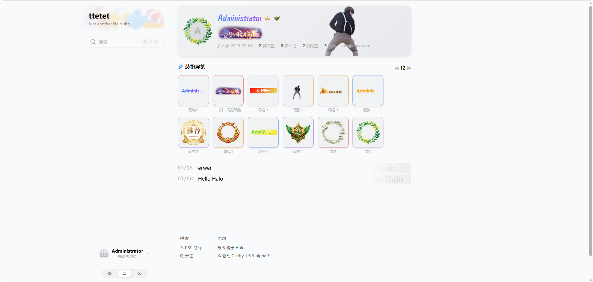

# Interaction Plus 前台适配指南

面向 **Halo 主题作者与提供前台 Thymeleaf 页面的插件作者**：如何展示用户的装扮（头像框、称号、勋章、身份标识、名片背景等）。

> 插件名：`interaction-plus`。以下资源仅在插件**已安装并启用**时可用，接入方应做好降级（见[降级与兼容](#降级与兼容)）。

## 能力总览

插件面向 Halo 前台模板提供三套对外能力（前两套都是「取数据」，按渲染方式选）：

| 能力 | 渲染方式 | 适合 |
|---|---|---|
| [Runtime Web Component](#web-component-组件) | 客户端 | 最省事：引入一个 JS，写自定义标签即可，无需懂数据结构。含用户卡点击浮层等交互 |
| [Finder API](#finder-apihalo-模板-ssr) | 服务端（SSR） | 需要完全自定义 HTML、SEO 友好、首屏不闪 |
| [公开 HTTP API](#公开-http-api) | 自定义 | 前端 fetch 取数据自己画 |

**怎么选（极简）：**

- 要省事、要用户卡点击浮层 → **Web Component**（长得不像你的主题？后台贴 HTML/CSS [自定义模板](#自定义模板)接管渲染）
- HTML 结构要自己写、要 SEO → **Finder** 取数后自绘
- 前端自己 fetch → **公开 HTTP API**

## 引入 Runtime

在主题或插件前台的 Thymeleaf 模板中按需引入**一个 JS**：

```html
<th:block th:if="${pluginFinder.available('interaction-plus')}">
  <script th:src="${interactionPlus.getRuntimeUrl()}"></script>
</th:block>
```

- 产物为 IIFE 格式，引入即自动注册 `hip-*` 自定义元素。
- **没有配套 CSS 要引**：组件样式全部在各自的 Shadow DOM 模板里，插件不往页面注入任何样式表。
- **不会自动注入任何页面**，由接入方决定在哪里放组件。
- 资源路径固定为 `/plugins/interaction-plus/assets/runtime/**`（由插件 ReverseProxy 暴露）。
- `getRuntimeUrl()` 从 Halo 的插件上下文读取当前安装版本，实际输出形如 `/plugins/interaction-plus/assets/runtime/interaction-plus.runtime.js?v=1.0.0`。版本查询参数用于区分固定文件名的浏览器缓存，接入方不用手工维护。
- `pluginFinder.available(...)` 适合可选集成；若调用方已把 `interaction-plus` 声明为必需依赖，也可只保留内层 `<script>`。

## Web Component 组件

共 3 个组件。通用约定：

- `user-name`：传用户名，组件自动请求该用户的公开身份数据。
- `data`：直接传入公开身份 JSON（结构见[公开 HTTP API](#公开-http-api)），**优先于 `user-name`**，可避免逐个请求。
- `scene`：声明这个标签所处的**场景**（如 `comment` / `post`），供模板 CSS 按场景分档（见[场景分档](#场景分档)）。可选，不填走默认形态。
- 请求失败时**静默降级**，不报错；素材图片加载失败自动兜底（头像回退首字母占位、身份标识图标回退文字牌），不产生空洞。
- 使用 Shadow DOM，样式隔离，**不能从外部为内部节点写选择器**。`line-height` / `font` / `color` 等**继承属性**仍会从 `<hip-*>` 宿主穿进来；内置用户卡已在浮层 `.card` 上锁行高，主题可以给宿主写 `line-height: 0` 压胶囊、不会压到卡面。要改外观走[自定义模板](#自定义模板)。

### hip-user-avatar：头像 + 头像框

```html
<hip-user-avatar user-name="alice"></hip-user-avatar>
<hip-user-avatar user-name="alice" scene="comment"></hip-user-avatar>
```

- 默认 40px，头像框自动跟随容器缩放。
- 没人覆盖时，尺寸由**模板**按 `scene` 决定（内置默认模板：`comment` 36px / `post` 40px / `moment` 48px / `sidebar`·`list` 32px / `profile` 96px）。调用方先声明场景；要改**自己输出的那些**，在标签或容器上设 [`--hip-avatar-size`](#调用方覆盖头像尺寸)。
- **没有 `size` 属性**：尺寸不走标签属性（那要求把属性值拼进样式表），覆盖口子就是上面那个 CSS 变量。

### hip-user-identity：身份行

昵称样式 + 身份标识 + 称号 + 主勋章，最适合**评论区 / 文章作者**的昵称行：

```html
<hip-user-identity user-name="alice"></hip-user-identity>
```

**昵称可点击跳转用户页**（身份标识 / 称号 / 勋章不跳转），与用户卡共用后台「装饰展示」里的跳转链接模板；清空该设置即两处一起关闭。


上图是身份行与用户卡在评论区的实际效果（论坛等第三方插件里同理）。

### hip-user-card：用户卡

组合头像、身份、称号、名片背景、互动统计、勋章展柜与简介的大卡（**桌面端宽 560**）：
整卡背景全彩展示（顶部 60px 露出带）+ 半透明内容层；高度跟内容走（满配大约 298：露出带 60 + 内容层下限 238，
数据行或名字换行可再长高）；背景素材按 560:298 比例居中裁切，推荐素材 1120×596；
个人说明区固定两行、底部勋章展柜行恒占一格高，两者空值也占位 —— 卡高不随这个用户戴了多少装扮而跳动；
数据行内置文章 / 评论 / 勋章计数，并自动接入其他插件贡献的统计项。
**点击触发元素显示 / 再点关闭**（键盘 Enter/Space 等效），外点 / Esc 关闭；**同页同时只展开一张**，点第二个人时第一张自动收起；
卡内**头像与名字可点击跳转用户页**（身份标识 / 称号 / 勋章不跳转）——链接模板在后台「装饰展示」设置（`{name}` 替换为用户名，
默认 `/authors/{name}` 即 Halo 主题作者页；主题没有作者页或想关闭跳转时清空该设置即可）；
桌面端锚定触发元素展开、水平方向自动钳制在视口内（下方放不下时翻到上方展开），页面滚动时跟随触发元素；
窄屏（≤640px）切换为固定全宽卡 + 半透明遮罩、高度随内容自适应（上限 85vh 内部滚动）、页面滚动即关闭：

```html
<hip-user-card user-name="alice">
  <!-- 默认插槽 = 触发元素（如用户名 / 头像） -->
  <span>alice</span>
</hip-user-card>
```

> **卡片走浏览器的 top layer**（`popover`），所以不受主题任何层叠上下文与 `overflow: hidden` 的影响 —— 评论项上常见的 `position:relative;z-index`、`transform`、`filter`、滚动动画库加的 `will-change`，都不会把它压住或裁掉。**你不需要为它调整任何容器样式。**
>
> 不支持 `popover` 的浏览器（Chrome < 114 / Safari < 17 / Firefox < 125）自动回落到 `fixed` + `z-index: 9999` 的原地定位，功能与交互完全一致，只有在「主题给容器建了层叠上下文」时可能被后面的兄弟元素盖住 —— 已知降级，不影响其余浏览器。

### 批量场景：用 data 避免 N 次请求

列表 / 评论区有多个用户时，先用 `POST /identities` 批量取数据，再给每个组件传 `data`。
`data` 里必须带 `userName`：runtime 用它和后台跳转模板拼 `profileUrl`，缺了头像 / 名字不跳转。

```html
<hip-user-identity data='{"userName":"alice","displayName":"Alice", ...}'></hip-user-identity>
```

## 评论区与作者信息接入

Halo 评论区由主题渲染。在主题模板里把用户名包进组件即可（变量名以你的主题为准）：

```html
<!-- 评论作者：悬浮卡片（点击触发） -->
<hip-user-card th:user-name="${comment.spec.owner.name}">
  <span th:text="${comment.spec.owner.displayName}">用户名</span>
</hip-user-card>

<!-- 或直接渲染身份行 -->
<hip-user-identity th:user-name="${author.metadata.name}"></hip-user-identity>
```

> 若评论区由浏览器端 JS 组件渲染（如官方评论插件），主题的 Thymeleaf 画不到那段 DOM——需要该组件自身支持嵌入 `hip-*` 标签。

## Finder API（Halo 模板 SSR）

对齐 Halo 模板集成方式：在由 Halo 渲染的 Thymeleaf 模板里直接调用 `${interactionPlus.xxx}`。主题模板和独立插件前台模板都可使用；浏览器不需要为 Runtime 版本再请求一个接口。

身份与装扮数据走**服务端渲染**——SEO 友好、首屏不闪，适合需要完全自定义 HTML 的场景（Web Component 是客户端渲染的便捷替代）。

变量名：`interactionPlus`，三个方法：

| 方法 | 返回 | 说明 |
|---|---|---|
| `${interactionPlus.getRuntimeUrl()}` | Runtime URL | 带当前安装插件版本的完整静态资源地址，供 `th:src` 使用 |
| `${interactionPlus.getIdentity('alice')}` | 身份对象 | 同[公开 HTTP API](#公开-http-api) 的 `/identity` 结构（基础信息 + 佩戴装饰 + 身份标识 + 互动统计 + 站点级展示策略） |
| `${interactionPlus.getDecorations('alice')}` | 装饰数组 | 同 `/identity/{u}/decorations`（装饰墙，尊重公开开关）；差异：用户不存在或被禁用时 Finder 返回空数组（模板无需判空报错），HTTP API 返回 404 |

> 两个数据 Finder 与公开 HTTP API **同源**（共用 `PublicIdentityService`），返回结构完全一致，只是出口不同：Finder 给模板 SSR，HTTP API 给前端 fetch。返回字段详见[公开 HTTP API](#公开-http-api) 的响应示例。

用法：

```html
<!-- 作者身份行（SSR） -->
<th:block th:with="id = ${interactionPlus.getIdentity(author.metadata.name)}">
  <div th:if="${id != null}">
    
    <span th:text="${id.displayName}"></span>
    <!-- 称号（若佩戴）：titleText 是称号名称、恒非空；t.url 是可选的称号图
         （多为横条插画，缩到一行文字的高度会看不清，建议只在有垂直空间的位置用） -->
    <th:block th:if="${id.decorations?.title}" th:with="t = ${id.decorations.title}">
      <span th:text="${t.titleText}"></span>
    </th:block>
  </div>
</th:block>

<!-- 装饰墙（个人主页 / 作者页） -->
<ul>
  <li th:each="d : ${interactionPlus.getDecorations(profileUser.name)}">
    
  </li>
</ul>
```

- 用户不存在 / 被禁用时 `getIdentity` 返回空，用 `th:if` 判空。
- ⚠ **`th:with` 和判它的 `th:if` 别写在同一个标签上**。Thymeleaf 的属性优先级里 `th:if`（300）先于 `th:with`（600），同标签时判空跑在赋值之前、变量还不存在，条件恒为假，**整块被静默丢弃、不报错**。所以上面把 `th:with` 提到外层 `<th:block>`。（第二个 `th:block` 无此问题：它的 `th:if` 判的是外层已定义的 `id`，不是同标签的 `t`。）
- 返回的 `Mono` 由 Halo 主题引擎自动订阅解包，模板里直接当结果对象用，无需手动 `.block()`。

## 公开 HTTP API

Base：`/apis/api.interaction-plus.timxs.com/v1alpha1`（游客可访问）。

| 方法 | 路径 | 说明 |
|---|---|---|
| GET | `/identity/{userName}` | 单用户公开身份：当前佩戴的装扮 + 身份标识 + 互动统计 + 站点级展示策略（`display`，非该用户属性） |
| POST | `/identities` | 批量，body `{"userNames":["a","b"]}`，单次最多 50、自动去重；响应 `{"items":[身份对象…],"skipped":["查无或不可用的用户名…"]}` |
| GET | `/identity/{userName}/decorations` | **装饰墙**：该用户获得的全部有效装饰（自包含完整信息；尊重用户「公开装扮墙」开关，关闭则返回空数组；用户不存在或被禁用时 404，与 `/identity/{userName}` 口径一致） |

`/identity/{userName}` 返回（节选；完整字段见 [对外插件 API 对接指南](plugin-api-integration.md)，如 `identityMarks[].priority`、`titleBackgroundSecondary`、`mediaType`）：

```jsonc
{
  "userName": "alice",
  "displayName": "Alice",
  "avatar": "https://.../avatar.png",
  "bio": "……",
  "registeredAt": "2021-03-01T00:00:00Z",
  "identityMarks": [
    { "displayName": "管理员", "color": "#dc2626" },
    { "displayName": "版主", "icon": "data:image/svg+xml,..." }
  ],
  "decorations": {
    "avatarFrame": { "assetName": "...", "type": "avatar_frame", "url": "..." },
    "title": { "type": "title", "titleText": "...", "titleColor": "...", "titleBackground": "...", "url": "（可选，称号图）" },
    "primaryBadge": { "type": "badge", "url": "..." },
    "badgeShowcase": [{ "type": "badge", "url": "..." }],
    "cardBackground": { "type": "card_background", "url": "..." },
    "nameStyle": { "type": "name_style", "nameStyle": { "mode": "gradient", "colors": ["#...","#..."] } }
  },
  "stats": {
    "posts": 128,
    "comments": 356,
    "decorations": { "total": 12, "badge": 9, "avatarFrame": 1, "title": 1, "nameStyle": 1, "cardBackground": 0 },
    "extras": [{ "source": "some-qa-plugin", "key": "accepted", "label": "采纳", "value": "23" }]
  },
  // 站点级展示策略（站长设置，全站一份），不是该用户的属性
  "display": {
    "identityLine": { "showTitle": true, "showPrimaryBadge": true, "showNameStyle": true, "showIdentityMarks": true, "identityLimit": 1 },
    "avatar": { "showFrame": true },
    "userCard": { "showTitle": true, "showPrimaryBadge": true, "showShowcase": true, "showNameStyle": true, "showIdentityMarks": true, "showAvatarFrame": true, "showCardBackground": true, "showcaseBadgeLimit": 5, "identityLimit": 3 },
    "userCardLinkTemplate": "/authors/{name}",
    "avatarFallbackStyle": "halo"
  }
}
```

**身份标识三形态**（`icon` 与 `color` 互斥，同一标识至多其一非空）：

| 形态 | 字段 | 渲染 |
|---|---|---|
| 文字牌 | `color` 有值、`icon` 为 null | 带色边框 + 文字 |
| 图标 | `icon` 为 data URL（Iconify 字形）、`color` 为 null | 小图标 |
| 图片 | `icon` 为图片地址、`color` 为 null | 小图 |

`displayName` 始终存在：文字牌的牌面、图标 / 图片的悬停提示，以及图片加载失败时回落为文字牌。主题按 `icon` 是否为空分流即可（`hip-user-*` 已内置该逻辑与裂图回落，无需自行兜底）。

**互动统计 `stats`**（用户卡数据行与「加入时间」的数据源）：`posts` / `comments` 为公开口径计数（已发布文章、已审核评论）；`stats.decorations` 为各类装扮的持有计数，**为 `null` 表示用户关闭了公开装扮墙**（此时请勿显示勋章计数）；`extras` 为其他插件贡献的统计项（`source` 是来源插件 id，`value` 已格式化、原样展示即可）。

**称号 = 名称 + 可选的图**（没有形态开关）：`titleText` 是称号名称、恒非空；`titleColor` / `titleBackground`（可选 `titleBackgroundSecondary`，两者形成 135° 渐变）都可空，颜色为 `#RGB` / `#RRGGBB` / `#RRGGBBAA`（8 位带透明度）。没选文字色则继承正文，没选背景则无底，内置模板不铺默认灰。`url` 有值时是称号图，此时 `titleText` 同时作它的替代文本与加载失败回落。**分场景用**：行内（评论、列表）只用 `titleText`——称号图多是画布里嵌着文字的横条插画，缩到一行文字的高度（约 `1.25em`）图里的字只剩几像素；图留给用户卡这类有垂直空间的位置（内置卡片限高 `48px`）。`hip-user-*` 组件已内置这套规则（行内摘图只留文字牌，卡片 `max-height` + `max-width` 双上限按素材比例取最优尺寸；要调就走[自定义模板](#自定义模板)改 CSS），自渲染的主题请自行限制。

`/identity/{userName}/decorations` 返回装饰数组（每项自包含，无需再按 id 查询）：

```jsonc
[
  { "assetName": "asset-x", "type": "badge", "displayName": "社区成员",
    "url": "https://.../badge.png",
    "rarityName": "rarity-epic", "rarityDisplayName": "史诗", "rarityColor": "#a335ee",
    "grantedAt": "2026-06-01T08:00:00Z", "expiresAt": null }
]
```

- 稀有度显示名 / 颜色已内联，主题可直接展示（`rarityName` 内部名仅作样式标识用）；`grantedAt` 为获得时间；`expiresAt` 为 `null` 表示永久。

> 装饰墙适合"有个人主页 / 作者页"的主题做荣誉墙；用户可在「用户中心 → 个人资料 → 装扮」里关闭公开。



主题自绘的装饰墙示例（本插件只提供数据，样式由主题决定）。

## 自定义模板

想让组件长成主题的样子？**在后台贴 HTML + CSS，完全接管组件的渲染。**

入口：Console →「互动 → 装饰 → 自定义组件」（仅超级管理员可见）。三个组件（身份行 / 头像 / 用户卡）都支持，各自独立开关。

**模板有三个来源，按组件独立判断优先级：**

| 优先级 | 来源 | 谁写 |
|---|---|---|
| 1 | 后台「自定义组件」页 | 站长 |
| 2 | 主题内嵌 `<template data-hip="...">` | 主题作者（见[主题内嵌模板](#主题内嵌模板)） |
| 3 | 插件内置默认模板 | —— |

几个前提，先说清楚：

- **标签名固定**。外部始终写 `<hip-user-identity>`；启用自定义后，同一个标签渲染站长提供的内容，评论插件等消费方无需感知模板来源。
- **是手动对齐，不是自动跟随**。Shadow DOM **隔的是选择器**，外面写不到内部节点；但 `line-height` / `font` / `color` 仍会从宿主继承进来。浮层要自包含排版（内置用户卡锁在 `.card` 上，不要锁 `:host`，否则主题压胶囊触发器的 `line-height: 0` 会被抵消）。主题色、字号要跟主题走，需要你在模板里写一遍；**换主题需要重写**（写在主题 `<template>` 里则随主题走）。
- **打开编辑器时已预填好内置默认模板的全文**，所以「改个颜色」实际是改一行，不是从零写。
- **全放开**：样式、尺寸、布局、位置、交互、DOM 结构都归你；自定义用户卡不受内置模板 560×298 的尺寸设计限制。

整套契约只有三句：

```
{{路径}}       取一个数据，自动转义，可用在属性里
hipHelper.*   返回可直接 append 的 DOM 节点
hipData       完整数据，循环与条件自己写 JS
```

再补一条边界，免得和「全放开」打架：

- **CSS 框是 Shadow DOM 里唯一的样式来源**，组件代码里没有第二套。改字重、改颜色、跟不跟随父节点，都写在这里。
- **`hipHelper.render*` 的节点在代码里生成**，HTML 框里看不到那段结构。用 helper 就必须按内置类名写 CSS；不用 helper、自己拼 DOM，类名随便。
- **保存的自定义模板独立于内置模板**。需要重新使用内置内容时，在后台执行「恢复内置默认」并保存。

**完整案例**：[`samples/`](samples/) 收录了一份整卡替换的用户卡模板（`alt-user-card`，票根 + 通行证风格），占位符、`hipHelper`、`popover` 浮层、明暗适配、数据缺失兜底都有演示。

### 占位符

写在 HTML 框里，**只做一件事：取一个数据**。`{{路径}}` 按路径取值并自动 HTML 转义：

```html
<span class="who">{{displayName}}</span>
<a href="{{profileUrl}}" title="{{bio}}">主页</a>
<em>{{decorations.title.titleText}}</em>
<b>{{stats.posts}}</b> 篇文章
<span>{{identityMarks.0.displayName}}</span>
<span>{{attrs.scene}}</span>
```

规则：

- **顶层字段名拼错会红字报错**（如 `{{dispalyName}}`）——静默渲染成空白是最难自查的一类问题。可用顶层字段就是 [`hipData`](#hipdata) 的那些。
- **深层路径缺失输出空串**，不报错。用户没佩戴称号时 `{{decorations.title.titleText}}` 为空是正常数据形态，不该红屏。
- 取到的值是对象 / 数组时输出空串（没有合理的文本形态），需要它们请走 JS。
- **一律转义**，所以可以安全地写在属性里。
- **没有条件与循环语法**，那些走 JS。

### JS 执行环境

HTML 框里的 `<script>` 会在组件的 ShadowRoot 内执行，可直接访问五个变量：

| 变量 | 含义 |
|---|---|
| `hipData` | 身份数据（下详） |
| `hipHelper` | 节点构建与工具函数（下详） |
| `root` | 当前组件的 ShadowRoot，操作 DOM 用 |
| `host` | 宿主元素（`<hip-user-identity>` 本身） |
| `onCleanup(fn)` | 登记清理函数（下详） |

最小的一份模板长这样 —— 内置默认身份行就是它的完整版：

```html
<span class="line"></span>
<script>
  root.querySelector('.line').append(
    hipHelper.renderName(hipData),
    hipHelper.renderMarks(hipData),
    hipHelper.renderTitle(hipData)
  )
</script>
```

**执行时机**：每次渲染后。注意**一次组件生命周期内通常执行两次**——先渲染骨架（`hipData.loaded === false`），数据到达后重渲染再执行一次。重渲染会重建整个 ShadowRoot，内部 DOM 与其上的监听器一并丢弃，不会累积。

**`onCleanup(fn)`**：挂到 `document` / `window` 上的监听**不随 ShadowRoot 重建而消失**，必须登记，引擎会在下次渲染前与组件卸载时统一调用：

```js
function onDocClick(event) { /* ... */ }
document.addEventListener('click', onDocClick)
onCleanup(function () {
  document.removeEventListener('click', onDocClick)
})
```

`<script>` 里的 `{{ }}` **不会**被当作占位符替换（`if (a) {{ ... }}` 是合法 JS），JS 里直接读 `hipData` 即可。

### 重写用户卡模板时的注意事项

身份行与头像渲染完即最终形态，模板里没有交互逻辑，随便改。**用户卡不同**——它的插槽、展开、定位、关闭都在模板里，下面四段各自对应一个具体故障，删掉或改写就会复现。从预填的内置模板改起不会漏；从零手写请对照。

**1. `<slot>` 不能删**

它是主题放进标签中间的内容（通常是头像、昵称）的插口，也是点击触发元素。删掉后那些内容在前台**根本不会渲染**，全站变空白。这个后果在后台预览里看不出来——预览宿主是空的，永远走 `<slot>` 的回落内容。

**2. 卡与遮罩上的 `popover` 属性，以及 `showPopover()` / `hidePopover()` 调用**

卡靠它进浏览器的 [top layer](#hip-user-card用户卡)。去掉就退回普通层级，会被主题的层叠上下文压住、被祖先的 `overflow: hidden` 裁掉——评论项上常见的 `position:relative;z-index`、`transform`、`will-change` 都会触发。

**3. 展开时向 `document` 派发 `hip-user-card:open`，并监听它、`detail` 不是自己就收起**

内置模板用的是 `popover="manual"`，而 **`manual` 的规定行为就是「允许多个同时显示」**（原生 `popover="auto"` 才自带互斥，但它会连主题自己的下拉菜单一起顶掉，所以没用）。这段没有，同页点第二个人时第一张卡不会消失，卡会越点越多。

```js
// 展开时：广播（detail 传 host，用来认出「这条是我自己发的」）
document.dispatchEvent(new CustomEvent('hip-user-card:open', { detail: host }))

// 同时监听：别人展开了，自己让位
function onPeerOpen(event) {
  if (visible && event.detail !== host) { /* 收起自己 */ }
}
document.addEventListener('hip-user-card:open', onPeerOpen)
```

**4. 外点关闭的 `document` 监听挂在捕获阶段**

```js
document.addEventListener('click', onDocumentClick, true)   // ← 第三个参数
onCleanup(function () {
  document.removeEventListener('click', onDocumentClick, true)   // ← 摘除时同样要传
})
```

主题给列表项挂 `stopPropagation` 很常见（卡片式布局「点整行跳转」），冒泡阶段的监听会被它掐断，表现是**卡点开就关不掉**。捕获早于 target，不受任何 `stopPropagation` 影响。触发元素自己也会 `stopPropagation`（避免点昵称顺带触发主题的整行点击），所以这里更加不能挂冒泡。

第 3、4 条都往 `document` 上挂了监听，记得按上面 [`onCleanup`](#js-执行环境) 的要求登记摘除。

**后台预览态**：预览渲染在一个独立 iframe 里，模板脚本也在它的 realm 中编译——所以 `document` / `window` 都是那个 iframe 的，Console 的样式与事件两边互不相干。三个直接结果：

- **外点关闭只在预览区内生效**：点预览区里的空白照常收卡（与前台一致），点 Console 别处毫无影响。
- **`@media` 按 iframe 宽度判定**：窄屏形态勾上面板里的「窄屏」就能看，不必把浏览器窗口拖窄。
- **用户卡渲染完会自动展开**：引擎向模板的 `<slot>` 派发一次 click，等同于真人点了触发元素。**模板不需要为预览写任何逻辑。**

唯一要留意的跨 realm 细节：`hipHelper.render*` 返回的节点由父窗口创建，`append()` 照常工作（浏览器会自动 adopt），但在 append **之前**对它做 `instanceof` 判断会失败——拿 iframe 的构造器去比父窗口的对象。正常写法用不到这种判断。

预览高度取「内容高度」与组件档位的较大者，做高了会自动撑开；用户卡是绝对定位的浮层、不计入内容高度，靠 400px 的档位兜底。

模板里没有 `<slot>` 就不会自动展开，控制台给一条警告——那种模板真正的问题在前台，见[重写用户卡模板时的注意事项](#重写用户卡模板时的注意事项)。

身份行与头像不涉及自动展开：渲染完即最终形态，模板里也没有 `<slot>`。

### 循环怎么写

数组字段有三个，都保证**恒为数组**，可以直接 `forEach`：`hipData.identityMarks`、`hipData.decorations.badgeShowcase`、`hipData.stats.extras`。

> 通过 `data` 直接传入的对象可以省略 `hipData.stats`，使用前先判空；`identityMarks` 与 `decorations` 则恒存在。

```html
<span class="line"><span class="marks"></span></span>
<script>
  var box = root.querySelector('.marks')
  hipData.identityMarks.forEach(function (mark) {
    var el = document.createElement('span')
    el.className = 'my-mark'
    el.textContent = mark.displayName   // textContent，天然免疫 XSS
    if (mark.color) el.style.color = mark.color
    box.appendChild(el)
  })
</script>
```

> 零件与数量**不需要**你自己裁：交到模板手里的 `hipData` 已经按后台「装饰展示」里对应本组件的场景开关裁好了（身份行看「身份行」组、头像看「头像」组、用户卡看「用户卡」组；关掉某零件时对应字段直接不存在 / 数组为空）。裁完就拿不回来了 —— 展示策略是站点级的，改它请去设置页。类型总闸关了后端根本不吐该类型，场景开关管不到。

### hipData

结构与[公开 HTTP API](#公开-http-api) 的返回**一字不差**（数量按上条裁剪除外），额外挂三个派生字段：

```js
hipData.profileUrl   // 算好的跳转地址，空串表示不跳转
hipData.attrs        // 标签上的全部属性，如 { 'user-name': 'tim', scene: 'comment' }
hipData.loaded       // false = 数据尚未到达 / 请求失败
```

**`hipData` 永不为 `null`**，数据未到达或请求失败时给出骨架对象（只有用户名，其余为空）。`identityMarks`、`decorations.badgeShowcase`、`stats.extras`（`stats` 存在时）恒为数组，`decorations` / `display` 恒为对象，模板里可以直接 `.forEach` / `.length`。`stats` 本身可能不存在，用前先判。想区分加载态就判 `hipData.loaded`。`display` 是站点级展示策略（站长设置，全站一份），不是该用户的属性；自己画界面可以整个忽略。

### hipHelper

`render*` 系列返回**可直接 `append` 的 DOM 片段**（`DocumentFragment`，可能为空，不必判空）：

```js
hipHelper.renderName(data)     // 昵称（已应用名字样式渐变 / 纯色）
hipHelper.renderMarks(data)    // 身份标识（数量已裁好）
hipHelper.renderTitle(data)    // 称号（文字牌 + 可选图，加载失败回落文字牌）
hipHelper.renderBadge(data)    // 主勋章（未佩戴或关闭时为空片段）
hipHelper.renderAvatar(data)   // 头像 + 头像框叠放（含无头像占位；风格由 display.avatarFallbackStyle 决定）

hipHelper.escape(text)         // HTML 转义（只在确实要拼字符串时才需要）
hipHelper.escapeCssUrl(url)    // 转义 CSS url() 里的特殊字符
hipHelper.safeColor(hex)       // hex 白名单（3 / 6 / 8 位，8 位带透明度），非法返回空串
```

返回节点而不是 HTML 字符串，有三个用处：不必碰 `innerHTML`（零 XSS 风险）、转义不会漏、**片段可以在插入前后处理**：

```js
var marks = hipHelper.renderMarks(hipData)
marks.querySelectorAll('.mark').forEach(function (el) {
  el.style.color = ''        // 清掉跟着装扮走的内联色，交给你的 CSS
  el.style.borderColor = ''
})
root.querySelector('.line').append(marks)
```

> ⚠ **片段自带结构，不自带样式**。它们用的是内置类名（`.avatar` / `.avatar--fallback` / `.frame` / `.name` / `.mark` / `.mark-icon` / `.title` / `.title-img` / `.badge`），样式由 **CSS 框里的对应规则**提供。预填的默认 CSS 含这些规则，所以「只改 HTML 不动 CSS」时片段是有样式的；清空 CSS 框自己写时，用到的片段会裸奔。
>
> ⚠ **这些类名和结构是对外契约**，与 `hipHelper` 签名同级：可以在内部加节点，但不能改已有类名、不能把现有节点换成别的标签、不能拆掉「图 + 回落牌并排」或「首字母占位常驻叠放」。默认模板自己的容器类（`.line` / `.wrapper` / `.plink` / 用户卡布局类）不在此列，那是预填内容的私有约定。
>
> ⚠ **跟着装扮走的颜色是内联的**（昵称渐变、标识色、称号三色，以及 hash 风格无头像占位的背景 —— 它们每个用户都不一样，静态样式表表达不了），类选择器盖不住。要盖用 `!important`，或者像上面那样清掉内联色，或者干脆自己渲染。

### 主题内嵌模板

主题作者可以把模板**随主题一起交付** —— 站长不用开任何开关，装上主题就是这个样子：

```html
<template data-hip="identity">
  <style>
    .line { gap: 6px }
    .mark { border-radius: 10px; background: var(--my-theme-chip-bg) }
  </style>
  <span class="line"></span>
  <script>
    root.querySelector('.line').append(
      hipHelper.renderName(hipData),
      hipHelper.renderMarks(hipData)
    )
  </script>
</template>
```

- `data-hip` 取值：`identity` / `avatar` / `card`，一个组件一个 `<template>`。
- 整段内容就是 HTML 框（`<style>` 与 `<script>` 都写在里面），不分两个框。
- **必须出现在用到它的组件之前**，建议直接放 `<head>` 或引入 runtime 的 `<script>` 之前；读不到就走内置默认，不报错。
- 站长在后台配了同一个组件的模板时，**后台那份优先**。

### 场景分档

标签上的 `scene` 属性会落在宿主元素上，CSS 直接可选：

```html
<hip-user-avatar   user-name="tim" scene="comment"></hip-user-avatar>
<hip-user-identity user-name="tim" scene="comment"></hip-user-identity>
```

```css
:host([scene="comment"]) { font-size: var(--hip-avatar-size, 36px) }
:host([scene="comment"]) .title { display: none }
:host([scene="post"])    .name  { font-size: 16px }
```

- 插件**不预定义也不校验**取值，你想叫什么都行；匹配不上就走没有条件的 `:host` 规则，不会破版。
- 但**建议照这套推荐词表填**，否则站长要为一堆同义词写规则：`comment`（评论）/ `post`（正文）/ `moment`（瞬间）/ `sidebar`（侧栏）/ `profile`（个人页）/ `list`（列表）。
- **外部插件如果另起场景词**（例如 `guestbook` / `forum`）想让站长写成 `:host([scene="guestbook"])`，**必须自己给站长出说明**（词是什么、用在哪）。本插件文档不替他们列那些词；内置头像对不上词走默认 40px，站长不知道词就没法按那个场景单独调。推荐词能用就别另起。
- 一个标签同时属于多个场景时可以填多个词（`scene="comment reply"`），匹配换成 `:host([scene~="comment"])`。
- 收不拢的时候可以模糊匹配：`:host([scene*="comment"])` 能一次收掉 `comment` / `comments` / `comment-reply`。
- JS 侧读 `hipData.attrs.scene`。

**内置模板消费了哪些 scene**（下表只说默认那份；自定义模板里你想怎么用都行）：

| 组件 | 内置模板的分档 |
|---|---|
| `hip-user-avatar` | `comment` 36px / `post` 40px / `moment` 48px / `sidebar`·`list` 32px / `profile` 96px；未匹配走默认 40px。调用方可用 [`--hip-avatar-size`](#调用方覆盖头像尺寸) 盖掉这一棵 |
| `hip-user-identity` | 无 —— CSS 框末尾留了注释掉的示例，取消注释即生效 |
| `hip-user-card` | 无 —— 卡是浮层，形态只随视口宽度变化，与从哪儿点开无关 |

**scene 是场景类别，不是位置实例。** 同一个词被两处语义不同的位置共用时（比如文章评论区和留言板都填 `comment`），插件没有能力替你消歧 —— 它看到的只是一个字符串。这时该由调用方换一个更具体的词（`guestbook`），这也正是我们不校验取值的原因：给撞车的一方留出路。

> 站长那边没有别的通道可用：Shadow DOM 里**选不到外部祖先**，`:host-context()` 至今只有 Chromium 系支持。跨浏览器可用的上下文信息，只剩宿主元素自己身上的属性。

**scene 也不是唯一挂点。** 宿主上的**任何**属性都能当 CSS 选择器与数据来源，需要第二个维度时不必都挤进 scene 一个词：

```html
<hip-user-avatar user-name="tim" scene="comment" data-area="guestbook"></hip-user-avatar>
```

```css
:host([data-area="guestbook"]) { font-size: 28px }
```

JS 侧同样读得到：`hipData.attrs['data-area']`。

> 也可以**完全不依赖 scene**：把尺寸写成相对宿主正文字号的 `em`（如 `width: 2.5em`），评论区自动小、正文里自动大，一条规则通吃所有调用方。内置头像模板的注释里给了这个写法。

### 调用方覆盖头像尺寸

调用方（主题 / 第三方插件）改**自己种下去的头像**用的公开变量。自定义属性会继承进 Shadow DOM，内置头像模板写成 `var(--hip-avatar-size, 该档回落)`：设了用你的值，没设走 scene 分档。

```html
<!-- 整块一起改 -->
<div class="forum-thread" style="--hip-avatar-size: 28px">
  <hip-user-avatar user-name="tim" scene="list"></hip-user-avatar>
</div>

<!-- 只改这一颗 -->
<hip-user-avatar
  user-name="tim"
  scene="list"
  style="--hip-avatar-size: 28px"
></hip-user-avatar>
```

```css
.forum-thread {
  --hip-avatar-size: 28px;
}
```

- **只改你输出的那些**，不是全站某个 scene 词的含义。别人家的 `scene="list"` 不受影响。
- `scene` 仍要带：没设变量时走分档。
- 插件**不在** `:root` 或 `:host` 上定义这个变量，也不给它 `@property` 初值。谁要覆盖，谁在自己的树上设。
- 尺寸只有这一个口子，组件不提供 `size` 之类的标签属性。

**站长启用了自定义模板**时自己选认不认：

```css
/* 继续理睬调用方：没人设变量时用你的回落 */
:host { font-size: var(--hip-avatar-size, 40px); }
:host([scene="list"]) { font-size: var(--hip-avatar-size, 32px); }

/* 锁死：调用方再设也无效 */
:host([scene="list"]) { font-size: 50px; }
```

没启用自定义模板时，内置模板已经按第一种写。

不要在页面 `:root` 上定义 `--hip-avatar-size`。一写，全站头像都被盖掉，外部插件就改不动自己的了。

这是对外**唯一**公开的 `--hip-*` 尺寸变量，当例子用即可 —— 插件没有一整套视觉 token（颜色、卡片宽高、称号图尺寸那类），别往 `:root` 上堆同类变量，堆了也没有东西读它们。

**外部插件如果另起自己的变量或 scene 词**想让站长写进自定义模板，**必须自己给站长出说明**。变量写清名字、用在哪、不设时怎样；scene 写清词是什么、用在哪。本插件的文档不替他们列那些名字；内置模板也只认 `--hip-avatar-size` 和推荐六词。

### 明暗

两条路，按主题情况选：

**1. 用主题自己的 CSS 变量（推荐）** —— CSS 变量可继承穿透 Shadow DOM：

```css
.name { color: var(--theme-text-color); }
```

主题切暗色时自动跟随，零额外代码。

**2. `data-hip-dark` 属性**（主题没有变量时）：

```css
.name { color: #24292f; }
:host([data-hip-dark]) .name { color: #e9edf2; }
```

插件会检测主题的暗色挂点（`.dark` / `.color-scheme-dark` / `data-color-scheme="dark"`，以及 `.color-scheme-auto` / `data-color-scheme="auto"` + 系统 `prefers-color-scheme: dark`），命中即给每个 `hip-*` 宿主打上 `data-hip-dark`，主题切换时实时更新。**Shadow DOM 选不到外部的 `.dark`，这是自定义模板感知明暗的唯一通道。**

只跟随系统偏好的话，`@media (prefers-color-scheme: dark)` 在 Shadow DOM 内天然可用，直接写即可。

### 安全

> ⚠ **昵称和简介是普通用户可控的输入。**

- 只用占位符：`{{路径}}` **一律自动转义**，零 XSS 风险。
- 用 `hipHelper.render*` + `append` / `textContent` 写 DOM：也是安全的，这些 API 不解析 HTML。
- **只有自己拼 `innerHTML` 时才有风险**，那时任何用户可控内容必须先过 `hipHelper.escape()`。
- 模板 `<script>` 不是全局脚本，它由渲染引擎在**每个组件实例的每次渲染时**执行一次（页面上没有 `hip-*` 标签就一次都不执行）。但它跑在页面主 realm 里，能访问 `document` / `window`——**Shadow DOM 只隔离样式，不是 JS 沙箱**。所以写权限等价于「自定义 head 代码」的权限级别，后台该功能只对超级管理员开放。主题内嵌 `<template>` 的权限等同于主题本身。

### 错误处理

模板解析或 JS 执行抛错时，组件内渲染一行红字并在 `console.error` 输出完整堆栈（含组件名与用户名），**不会回落到内置默认模板**——静默回落会让你以为模板生效了。

拉取模板接口失败或超时（1 秒）是另一回事：那不是你的模板有问题，此刻只是还没拿到，插件会**静默用内置默认模板**渲染。

### 关于 `--hip-*` 变量

插件对外只有一个 CSS 变量口子：[`--hip-avatar-size`](#调用方覆盖头像尺寸)。没有配套样式表、也没有成套的视觉 token（颜色、卡片尺寸那类）—— 改外观走[自定义模板](#自定义模板)。

自定义模板契约包括[占位符](#占位符)、[`hipData`](#hipdata)、[`hipHelper`](#hiphelper) 的签名、**helper 片段产出的类名与结构**（见上节），以及上面这个变量。默认模板自己的容器类（`.line` / `.wrapper` / `.plink` / 用户卡布局类）不属于契约。

## 降级与兼容

- 插件未安装 / 未启用：`hip-*` 标签是未注册的自定义元素，浏览器**忽略标签本身但保留插槽内容**——所以 `<hip-user-card>用户名</hip-user-card>` 仍会显示"用户名"。建议主题始终在插槽里放原始内容。
- **同样适用于页面刚打开的一瞬间**：runtime 需要先取到自定义模板才注册自定义元素（避免「先按默认样子渲染一遍、模板到了再变一次」的闪烁），这期间标签尚未注册为自定义元素，页面显示的是插槽内容。请求在脚本解析时立即发起，超时为 1 秒；插槽里放原始内容可避免这段等待影响展示。
- 接口失败 / 用户无装扮：组件静默降级（`hip-user-identity` 退为纯昵称、`hip-user-avatar` 退为无头像占位——灰底或按名着色，由站长在「无头像占位」里选；`hip-user-card` 取数失败时只留触发内容、卡与点击交互一并移除，不可展开；用户只是未装扮时卡片照常展开、仅装饰槽位为空）。
- 资源 URL 仅在插件启用时有效，主题可在引入前做插件存在性判断（可选）。
- 只读取页面需要的字段；不要对公开 HTTP API / Finder 的整个返回对象做穷举式字段校验。

## 相关文档

- 站长后台（创建装饰、授予、展示设置、自定义组件入口）见[站长使用指南](site-admin.md)。
- 插件自己的前台 Thymeleaf 页面引入 Runtime 或调用 Finder，与主题使用同一套写法；插件 Java 后端对接则走[对外插件 API 对接指南](plugin-api-integration.md)（经 `ExtensionGetter` 进程内调用）：发奖 API 发放 / 撤销装饰（写），身份查询 API 后端查询用户公开身份与装扮（读）。
